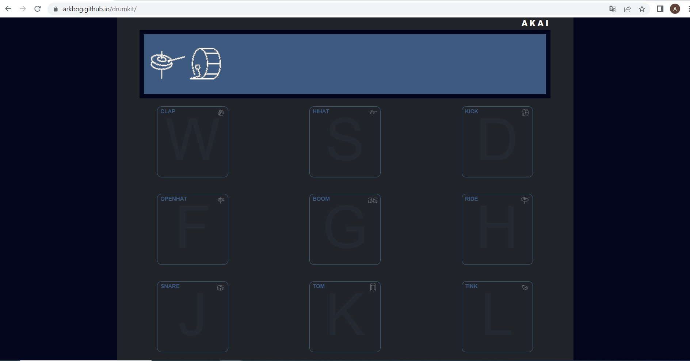

# Drum kit
> This project is a drum kit with a design-inspired Akai MPC.

## Table of Contents
* [General Info](#general-information)
* [Technologies Used](#technologies-used)
* [Features](#features)
* [Screenshots](#screenshots)
* [Setup](#setup)
* [Usage](#usage)
* [Project Status](#project-status)
* [Contact](#contact)

## General Information
The main goal of this project was a create an application, that would be a drum kit simulator. This application allows users to play sounds by using the keyboard or mouse. Project created to pass JavaScript exam.

## Technologies Used
- JavaScript,
- SCSS / CSS,
- HTML.

## Features
The user can play a sound by clicking a button or pressing a key on the keyboard. Keys description:
- "W" - Clap,
- "S" - Hihat,
- "D" - Kick,
- "F" - Openhat,
- "G" - Boom,
- "H" - Ride,
- "J" - Snare,
- "K" - Tom,
- "L" - Tink.
The top display shows a history of key presses. Application is responsive to 375px.

## Setup
[Click here](https://arkbog.github.io/drumkit/) and enjoy your beat!

## Usage

`wconst alertBlock = document.createElement("div");
alertBlock.classList.add("alert");
app.appendChild(alertBlock);

const alertText = document.createElement("div");
alertText.classList.add("alert-text");
alertBlock.innerText =
  "Bringing the power of a full drum set to your fingertips, anytime, anywhere. Click or press key to play a sound.";
alertBlock.appendChild(alertText);

const alertClose = document.createElement("div");
alertClose.classList.add("alert-close");
alertClose.innerText = "X";
alertBlock.appendChild(alertClose);`

The alarm is created in these lines. Two div's have been created because a flexbox has been used to split the alert into two parts.

## Project Status
Project is: complete.

## Contact
Created by [@ArkBog](https://github.com/ArkBog)

