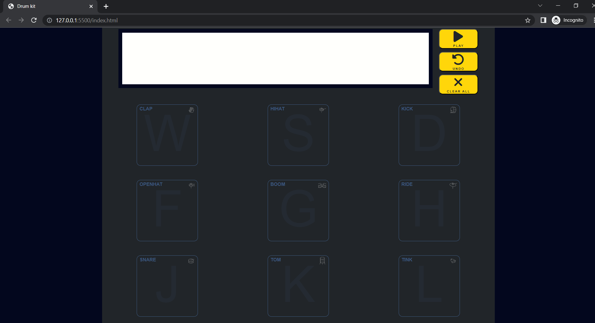

# Drum kit
> This project is a drum kit with a design-inspired Akai MPC.

## Table of Contents
* [General Info](#general-information)
* [Technologies Used](#technologies-used)
* [Features](#features)
* [Screenshots](#screenshots)
* [Setup](#setup)
* [Usage](#usage)
* [Project Status](#project-status)
* [Contact](#contact)


## General Information
The main goal of this project was a create an application, that would be a drum kit simulator. This application allows users to play sounds by using the keyboard or mouse. Project created to pass JavaScript exam.


## Technologies Used
- JavaScript,
- SCSS / CSS,
- HTML.


## Features
The user can play a sound by clicking a button or pressing a key on the keyboard. Keys description:
- "W" - Clap,
- "S" - Hihat,
- "D" - Kick,
- "F" - Openhat,
- "G" - Boom,
- "H" - Ride,
- "J" - Snare,
- "K" - Tom,
- "L" - Tink,
- "Backspace" - Undo,
- "Delete" - Clear all.

The top display shows a history of key presses. The application saves the history of plays. Application is responsive to 375px. The application has two modes - dark and light. The default is dark mode.



## Setup
[Click here](https://arkbog.github.io/drumkit/) and enjoy your beat!


## Usage

```
const docTitle = document.title;

window.addEventListener("blur", () => {
  document.title = "Comeback ♫";
});
window.addEventListener("focus", () => {
  document.title = docTitle;
});
```
The application checks that the user is in a tab. If the user exits, the title of the tab will change.
```
const alertBlock = document.createElement("div");
alertBlock.classList.add("alert");
app.appendChild(alertBlock);

const alertText = document.createElement("div");
alertText.classList.add("alert-text");
alertBlock.innerText =
  "Bringing the power of a full drum set to your fingertips, anytime, anywhere. Click or press key to play a sound.";
alertBlock.appendChild(alertText);

const alertClose = document.createElement("div");
alertClose.classList.add("alert-close");
alertClose.innerText = "X";
alertBlock.appendChild(alertClose);
```

The alert is created in these lines. Two div's have been created because a flexbox has been used to split the alert into two parts.

```
function closeAlert() {
  alertBlock.style.display = "none";
}

alertClose.addEventListener("click", closeAlert);
```
In these lines there is a function to close an alert and a listener function that runs after clicking an "X".

```
const buttonModeSwitch = document.createElement("label");
buttonModeSwitch.classList.add("switch");

const btnDark = document.createElement("i");
const btnLight = document.createElement("i");
btnDark.classList.add("fa-solid");
btnDark.classList.add("fa-moon");
btnLight.classList.add("fa-solid");
btnLight.classList.add("fa-sun");
buttonModeSwitch.appendChild(btnDark);
buttonModeSwitch.appendChild(btnLight);

const buttonMode = document.createElement("input");
buttonMode.setAttribute("type", "checkbox");

buttonModeSwitch.appendChild(buttonMode);
container.appendChild(buttonModeSwitch);
```
In this block of code are created the button to toggle a display mode. This button has a label and checkbox. The "i" elements have a classes from Fontawesome.

```
if (localStorage.getItem("mode") === "light") {
  lightMode();
  buttonModeSwitch.querySelector("input").checked = true;
} else {
  darkMode();
}

function lightMode() {
  let body = document.querySelector(":root");
  body.style.setProperty("--main-color", "#fffffc");
  body.style.setProperty("--background-color", "#ffd60a");
  body.style.setProperty("--text-color", "#212529");
  body.style.setProperty("--alert-color", "#212529");
  body.animate([{ opacity: 0 }, { opacity: 1 }], { duration: 500 });
  localStorage.setItem("mode", "light");
  btnDark.classList.remove("active");
  btnLight.classList.add("active");
}
function darkMode() {
  let body = document.querySelector(":root");
  body.style.setProperty("--main-color", "#212529");
  body.style.setProperty("--background-color", "#03071e");
  body.style.setProperty("--text-color", "#fffffc");
  body.style.setProperty("--alert-color", "#ffd60a");
  body.animate([{ opacity: 0 }, { opacity: 1 }], { duration: 500 });
  localStorage.setItem("mode", "dark");
  btnLight.classList.remove("active");
  btnDark.classList.add("active");
}

buttonMode.addEventListener("change", () => {
  if (buttonMode.checked) {
    lightMode();
  } else {
    darkMode();
  }
});

```
This block of code are creates functions for dark and light mode. First, the function gets a local storage and runs a right mode, also setting a checkbox to correct status. Next functions gets a :root and change colours as appropriate. Functions also sets a right preferences in local storage and changing display of buttons. In the next steps, a listener was added that reacts to a checkbox status change.

```
const pads = [
  { name: "clap", letter: "W" },
  { name: "hihat", letter: "S" },
  { name: "kick", letter: "D" },
  { name: "openhat", letter: "F" },
  { name: "boom", letter: "G" },
  { name: "ride", letter: "H" },
  { name: "snare", letter: "J" },
  { name: "tom", letter: "K" },
  { name: "tink", letter: "L" },
];
```
This array contains objects that have a drum name and an associated key.

```
pads.forEach((pad) => {
  const button = document.createElement("button");
  button.classList.add("button");
  button.setAttribute("id", `${pad.name}`);

  const letterBtn = document.createElement("p");
  letterBtn.innerText = `${pad.letter}`;

  const nameBtn = document.createElement("h1");
  nameBtn.innerText = `${pad.name}`;
  const icon = document.createElement("img");
  icon.classList.add("icon");
  icon.src = `./img/${pad.name}.png`;

  button.appendChild(nameBtn);
  button.appendChild(icon);
  button.appendChild(letterBtn);
  container.appendChild(button);

  const audio = document.createElement("audio");
  audio.src = `./samples/${pad.name}.wav`;
  container.appendChild(audio);

  button.addEventListener("click", () => {
    const history = document.createElement("img");
    history.classList.add("history");
    history.src = `./img/${pad.name}.png`;
    display.appendChild(history);
    save.push(`${pad.name}`);
    localStorage.setItem("pad", JSON.stringify(save));
    audio.play();
  });
});
```
In this forEach are created a buttons to play a sound by mouse. Firstly are created a buttons with class button and id responds to pad.name. The next few lines create an audio tag for each button and set the source using a pad name. The next step are to add a listener to each button. In callback is created an img that represents a pad icon, which is append to display. The next line updates a localstorage. The last line is a function to play an audio.

```
const keyboardAudio = document.createElement("audio");

document.addEventListener("keydown", (e) => {
  const history = document.createElement("img");
  history.classList.add("history");

  function pushKey(padValue) {
    const padId = document.getElementById(`${padValue}`);
    padId.animate(
      [
        { border: "solid 1px var(--border)" },
        { border: "solid 5px var(--active)" },
      ],
      {
        duration: 300,
      }
    );
    padId.querySelector("p").animate([{ opacity: ".1" }, { opacity: "1" }], {
      duration: 300,
    });
    history.src = `./img/${padValue}.png`;
    display.appendChild(history);
    keyboardAudio.src = `./samples/${padValue}.wav`;
    save.push(`${padValue}`);
    localStorage.setItem("pad", JSON.stringify(save));
    keyboardAudio.play();
  }

  switch (true) {
    case e.code === "KeyW":
      pushKey("clap");
      break;
    case e.code === "KeyS":
      pushKey("hihat");
      break;
    case e.code === "KeyD":
      pushKey("kick");
      break;
    case e.code === "KeyF":
      pushKey("openhat");
      break;
    case e.code === "KeyG":
      pushKey("boom");
      break;
    case e.code === "KeyH":
      pushKey("ride");
      break;
    case e.code === "KeyJ":
      pushKey("snare");
      break;
    case e.code === "KeyK":
      pushKey("tom");
      break;
    case e.code === "KeyL":
      pushKey("tink");
      break;
    case e.code === "Backspace":
      undo();
      historyUndo.animate(
        [
          { backgroundColor: "var(--alert-color)" },
          { backgroundColor: "#fffffc" },
        ],
        {
          duration: 300,
        }
      );
      break;
    case e.code === "Delete":
      clearAll();
      historyClearAll.animate(
        [
          { backgroundColor: "var(--alert-color)" },
          { backgroundColor: "#fffffc" },
        ],
        {
          duration: 300,
        }
      );
      break;
  }
});
```
This block of code is for the creation of a function which will play a sound from the keyboard. The first step is to create an audio tag. The next step is to add a listener to the audio tag. The listener gets an event (e). In the callback a img is created which represents an icon pad. In the next lines we create an animation for buttons after pressing a key. The next step is to set an audio source and play a sound using the play() function. The next code block is a switch. The switch has a cases that responds when a key is pressed. Cases "backspace" and "delete" are responsible for cleaning a plays history.

```
let save = [];
```
This array saves a history of plays.
```
save.push(`${pad.name}`);
```
Functions responsible for plays, has a this line. This command add a pad name to let "save", after the button was pressed.

```
localStorage.setItem("pad", JSON.stringify(save));
```
Functions also has a this line. This line change array "save" to string and updates a local storage.

```
let localSave = localStorage.getItem("pad");
let newLocalSave = JSON.parse(localSave);

if (newLocalSave !== null) {
  newLocalSave.forEach((element) => {
    const localHistory = document.createElement("img");
    localHistory.classList.add("history");
    localHistory.src = `./img/${element}.png`;
    display.appendChild(localHistory);
    save.push(`${element}`);
  });
}
```
Local storage are download to let "localSave". In the next step, "localSave" is changing for array. This are possible to makes a if loop. In this loop are creating a "img", which next is display. The last line updates a let "save".

```
function undo() {
  const lastChild = document.querySelectorAll(".history");
  const arrLastChild = Array.from(lastChild);
  arrLastChild.pop();
  save.pop();
  localStorage.setItem("pad", JSON.stringify(save));
  while (display.hasChildNodes()) {
    display.removeChild(display.firstChild);
  }
  arrLastChild.forEach((element) => {
    const currentHistory = document.createElement("img");
    currentHistory.setAttribute("src", `${element.currentSrc}`);
    currentHistory.classList.add("history");
    display.appendChild(currentHistory);
  });
}
historyUndo.addEventListener("click", undo);
```
This function is responsible for undoing. At the start, the function gets all elements with class "history;". Next, elements are changed from node to array and the last elements are deleted. Also the last element is delete in array "save". The next step is to update a local storage. The while loop deletes a current display of history. The forEach loop displays a new history, without the last, deleted element.

```
function clearAll() {
  const allHistory = document.querySelectorAll(".history");
  let arrAllHistory = Array.from(allHistory);
  arrAllHistory = [];
  save = [];
  localStorage.setItem("pad", JSON.stringify(save));
  while (display.hasChildNodes()) {
    display.removeChild(display.firstChild);
  }
}
historyClearAll.addEventListener("click", clearAll);
```
The clearAll() is similar to undo(). The difference is, that this function removes all elements from arrays.

## Project Status
Project is: in work.


## Contact
Created by [@ArkBog](https://github.com/ArkBog)

